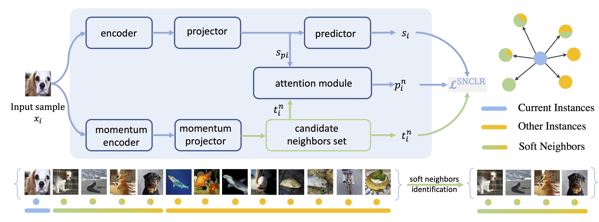

<div align="center">

### **Soft Neighbors are Positive Supporters in Contrastive Visual Representation Learning**

Chongjian GE, Jiangliu Wang, Zhan Tong, Shoufa Chen, Yibing Song, Ping Luo


#### [project page](https://chongjiange.github.io/snclr.html) |  [arXiv](https://arxiv.org/abs/2303.17142) 

</div>


## Abstract
Contrastive learning methods train visual encoders by comparing views from one instance to others. 
Typically, the views created from one instance are set as positive, while views from other instances are negative. 
This binary instance discrimination is studied extensively to improve feature representations in self-supervised learning. 
In this paper, we rethink the instance discrimination framework and find the binary instance labeling insufficient to measure correlations between different samples. 
For an intuitive example, given a random image instance, there may exist other images in a mini-batch whose content meanings are the same (i.e., belonging to the same category) or partially related (i.e., belonging to a similar category). 
How to treat the images that correlate similarly to the current image instance leaves an unexplored problem. 
We thus propose to support the current image by exploring other correlated instances (i.e., soft neighbors). 


## Requirements

To install requirements:

```setup
conda create -n snclr python=3.7
conda install pytorch==1.12.1 torchvision==0.13.1 torchaudio==0.12.1 cudatoolkit=11.3 -c pytorch
conda activate snclr
pip install -r requirements.txt
```
>📋  Pytorch>=1.6 is needed for runing the code.

## Training

Before training the ViT-S (300 epoch) in the paper, run this command first to add your PYTHONPATH:

```train
export PYTHONPATH=$PYTHONPATH:{your_code_path}/snclr/
```
```train
bash start.sh      #(The training script is used for trianing SNCLR with 4 machines)
```

## Evaluation
Before start the evaluation, run this command first to add your PYTHONPATH:

```eval
export PYTHONPATH=$PYTHONPATH:{your_code_path}/care/
```

Please refer to the evaluation protocol in [MoCov3](https://github.com/facebookresearch/moco-v3) for evaluation.


## Basic Implementation
`snclr/nn_memory_norm_bank_multi_keep.py` implements a memory bank with nearest neigbours. 
In its forward pass, you input an output which updates the bank. Then the nearest neighbours to the output are returned.

`snclr/builder_snclr_factor.py` implements the training procedure.

## Acknowledgements
The project is based on [MoCo](https://github.com/facebookresearch/moco), [MoCov3](https://github.com/facebookresearch/moco-v3), [NNCLR1](https://github.com/MalteEbner/NNCLR) and [2](https://docs.lightly.ai/self-supervised-learning/examples/nnclr.html). Thanks for their awesome works.

### License
This project is under the MIT license.

## Citation
If you find SNCLR useful or relevant in your research please consider citing our paper:
```
@article{ge2023soft,
  title={Soft Neighbors are Positive Supporters in Contrastive Visual Representation Learning},
  author={Ge, Chongjian and Wang, Jiangliu and Tong, Zhan and Chen, Shoufa and Song, Yibing and Luo, Ping},
  journal={arXiv preprint arXiv:2303.17142},
  year={2023}
}
```


